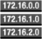

# networking_content_delivery

|   |   |   |   |
|---|---|---|---|
| [cloudfront.puml](cloudfront.puml) |  |  |  | 
| [cloudfront_downloaddistribution.puml](cloudfront_downloaddistribution.puml) |  |  |  | 
| [cloudfront_edgelocation.puml](cloudfront_edgelocation.puml) |  |  |  | 
| [cloudfront_streamingdistribution.puml](cloudfront_streamingdistribution.puml) |  |  |  | 
| [directconnect.puml](directconnect.puml) |  |  |  | 
| [elasticloadbalancing.puml](elasticloadbalancing.puml) |  |  |  | 
| [elasticloadbalancing_applicationloadbalancer.puml](elasticloadbalancing_applicationloadbalancer.puml) |  |  |  | 
| [elasticloadbalancing_classicloadbalancer.puml](elasticloadbalancing_classicloadbalancer.puml) |  |  |  | 
| [route53.puml](route53.puml) |  |  |  | 
| [route53_hostedzone.puml](route53_hostedzone.puml) |  |  |  | 
| [route53_routetable.puml](route53_routetable.puml) |  |  |  | 
| [vpc.puml](vpc.puml) |  |  |  | 
| [vpc_customergateway.puml](vpc_customergateway.puml) |  |  |  | 
| [vpc_elasticnetworkadapter.puml](vpc_elasticnetworkadapter.puml) |  |  |  | 
| [vpc_elasticnetworkinterface.puml](vpc_elasticnetworkinterface.puml) |  |  |  | 
| [vpc_endpoints.puml](vpc_endpoints.puml) |  |  |  | 
| [vpc_flowlogs.puml](vpc_flowlogs.puml) |  |  |  | 
| [vpc_internetgateway.puml](vpc_internetgateway.puml) |  |  |  | 
| [vpc_networkaccesscontrollist_amazonvpc_networkaccesscontrollist.puml](vpc_networkaccesscontrollist_amazonvpc_networkaccesscontrollist.puml) |  |  |  | 
| [vpc_router.puml](vpc_router.puml) |  |  |  | 
| [vpc_vpcnatgateway.puml](vpc_vpcnatgateway.puml) |  |  |  | 
| [vpc_vpcpeering.puml](vpc_vpcpeering.puml) |  |  |  | 
| [vpc_vpnconnection.puml](vpc_vpnconnection.puml) |  |  |  | 
| [vpc_vpngateway.puml](vpc_vpngateway.puml) |  |  |  | 
| [_all.puml](_all.puml) |  |  |  | 
